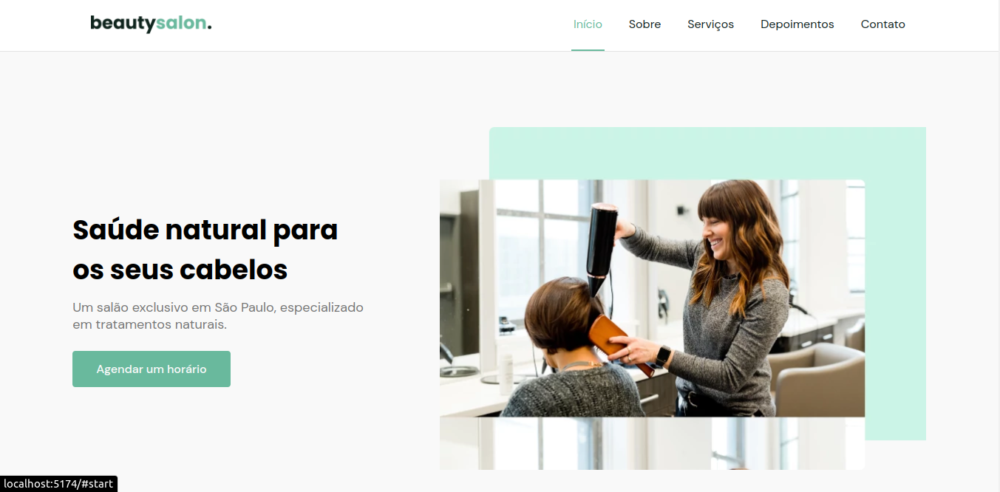

# Beautysalon landing page

Uma landing page responsiva para um salão fictício estilizada utilizando a abordagem _mobile first_. Esse projeto foi desenvolvido seguindo um protótipo do figma disponibilizado pela rocketseat.

# Veja você mesmo
Você pode acessar a aplicação funcional através desse link:
### [salon-landing-page-psi.vercel.app/](https://salon-landing-page-psi.vercel.app/)

# Tecnologias e ferramentas utilizadas
- ReactJS
- CSS modules
- React Icons
- ContextAPI

# Algumas funcionalidades
- Menu de navegação responsivo
- Carrousel dinâmico e responsivo
